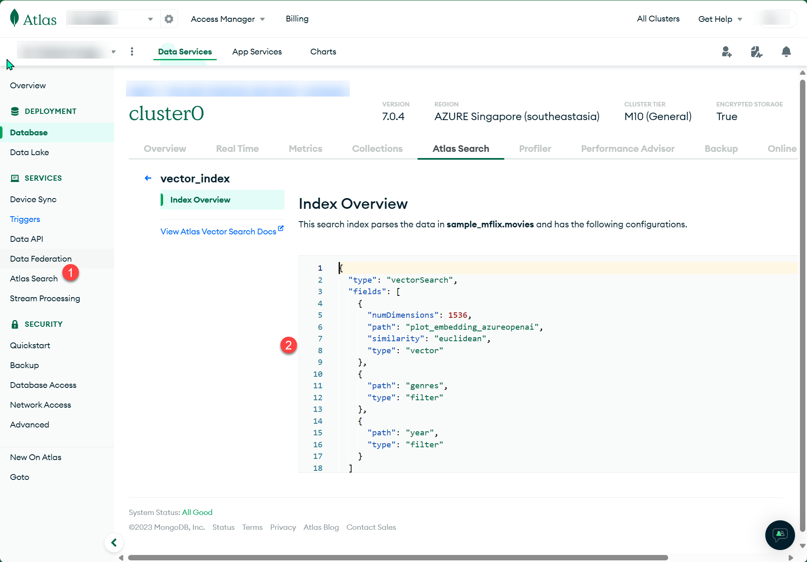
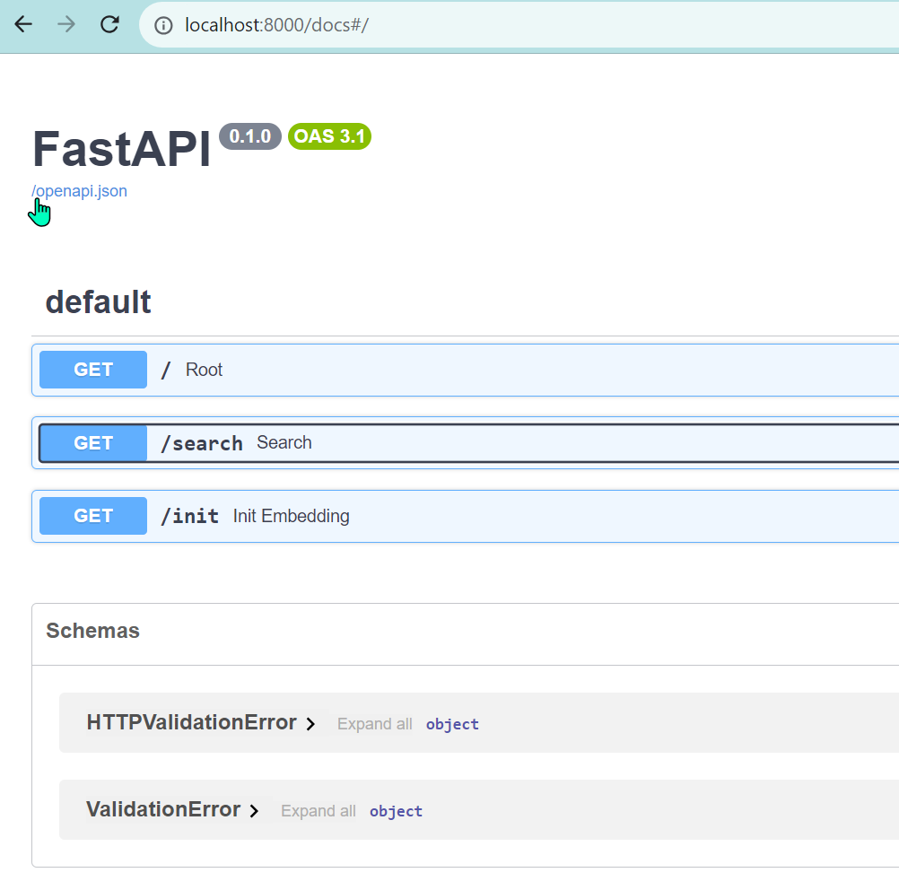
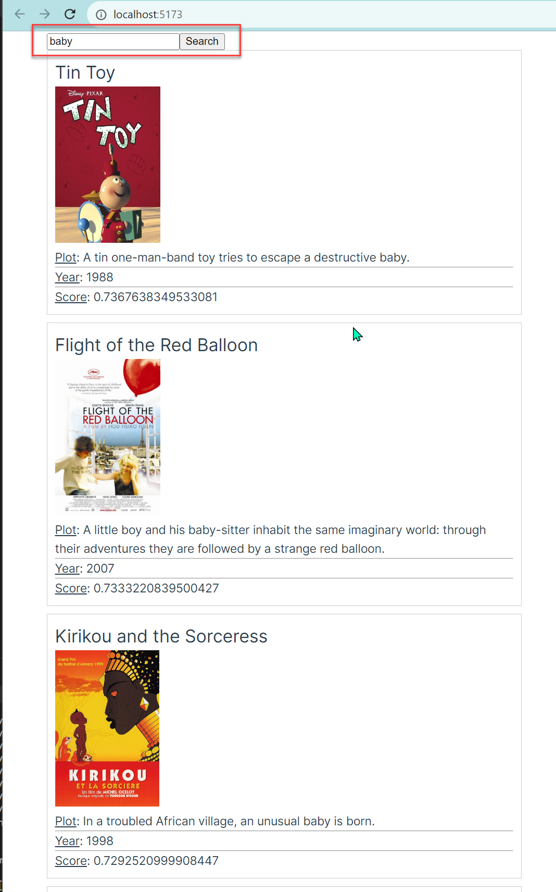
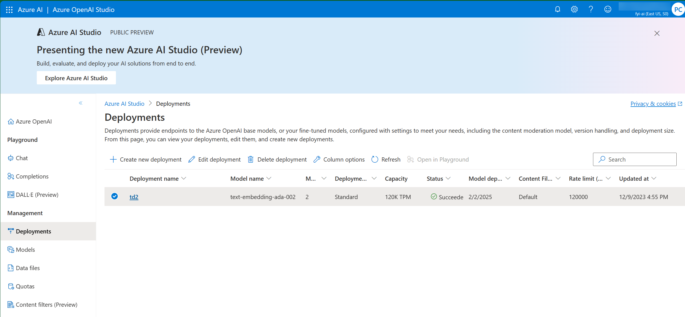

# Build Semantic Search Application with Azure OpenAI service and MongoDB Atlas Search

* Global AI Conference 2023
* Stack: Azure OpenAI Service, FastAPI, VueJS, LangChain, MongoDB Atlas Search (Atlas Vector Search)

* Reference 1: https://medium.com/microsoftazure/azure-openai-and-langchain-eba69f18f050
* Reference 2: https://techcommunity.microsoft.com/t5/startups-at-microsoft/build-a-chatbot-to-query-your-documentation-using-langchain-and/ba-p/3833134
* Reference 3: https://www.mongodb.com/developer/products/atlas/semantic-search-mongodb-atlas-vector-search/

* Create Atlas Vector Search Index
```shell
{
  "name": "vector_index",
  "type": "vectorSearch",
  "fields": [
    {
      "numDimensions": 1536,
      "path": "plot_embedding_azureopenai",
      "similarity": "euclidean",
      "type": "vector"
    },
    {
      "path": "genres",
      "type": "filter"
    },
    {
      "path": "year",
      "type": "filter"
    }
  ]
}
```
* Create .env.test
```shell
MONGODB_URI=""
AZURE_OPENAI_ENDPOINT=""
OPENAI_API_TYPE="azure"
OPENAI_API_KEY=""
OPENAI_API_VERSION ="2023-05-15"
```
* Run FastAPI
`uvicorn main:app --host 127.0.0.1 --port 8000 --reload`
* Run VueJS
`npm run dev`
## Create  Vector Search Index


## FastAPI

 
## VueJS


## Azure AI Studio


<style>
.custom-image {
  width: 800px;
  height: auto;
}
</style>